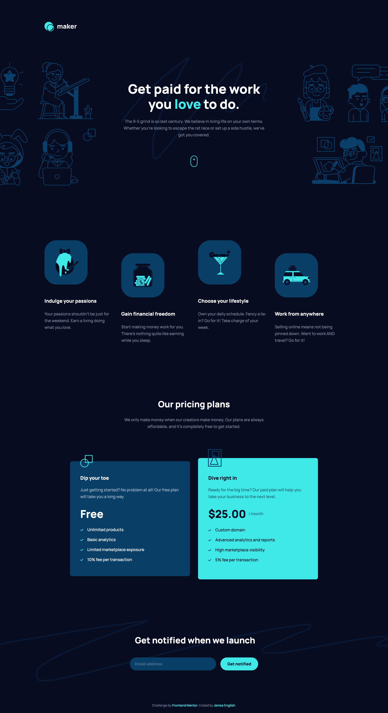

# Frontend Mentor - Maker pre-launch landing page solution

This is a solution to the [Maker pre-launch landing page challenge on Frontend Mentor](https://www.frontendmentor.io/challenges/maker-prelaunch-landing-page-WVZIJtKLd). Frontend Mentor challenges help you improve your coding skills by building realistic projects. 

## Table of contents

- [Overview](#overview)
  - [The challenge](#the-challenge)
  - [Screenshots](#screenshots)
  - [Links](#links)
- [My process](#my-process)
  - [Built with](#built-with)
  - [What I learned](#what-i-learned)
  - [Continued development](#continued-development)
  - [Useful resources](#useful-resources)
- [Author](#author)

## Overview

### The challenge

Users should be able to:

- View the optimal layout depending on their device's screen size
- See hover states for interactive elements
- Receive an error message when the form is submitted if:
  - The `Email address` field is empty should show "Oops! Please add your email"
  - The email is not formatted correctly should show "Oops! That doesn’t look like an email address"

### Screenshots

### Links

- Solution URL: [Frontend Mentor](https://www.frontendmentor.io/solutions/mobile-first-design-using-scss-flexbox-grid-G5DeK5dVt)
- Live Site URL: [Vercel](https://fem-maker-prelaunch-landing-page.vercel.app/)

## My process

### Built with

- Semantic HTML5 markup
- Sass (SCSS)
- Flexbox
- CSS Grid
- Javascript
- Mobile-first workflow

### What I learned

On this project I tried to implement something like a "7-1 pattern" into my Sass, although since I didn't need all seven sections, it ended up more like a "4-1 pattern." Still, I am finding it enlightening and helpful to structure my thinking more modularly.

### Continued development

In the upcoming projects that I work on, I want to refine my SCSS code and improve its organization.

## Author

- Codepen - [@anglicus](https://codepen.io/anglicus)
- Frontend Mentor - [@anglicus](https://www.frontendmentor.io/profile/anglicus)
- FreeCodeCamp [@anglicus] (https://www.freecodecamp.org/anglicus)
